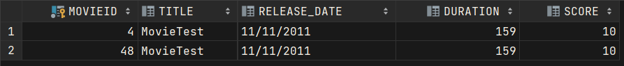
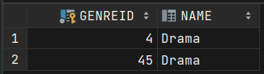

#Lab8's Assignment - Notes

## Compulsory

*[X] Create a relational database using any RDBMS (Oracle, Postgres, MySql, Java DB, etc.).

*[X] Write an SQL script that will create the following tables:
 * movies: id, title, release_date, duration, score
 * genres: id, name (for example: Action, Drama)
 * an associative (junction) table in order to store each movie genres

*[X] Update pom.xml, in order to add the database driver to the project libraries.
 
*[X] Create a singleton class in order to manage a connection to the database.
 
*[X] Create DAO classes that offer methods for creating movies and genres, and finding them by their ids and names.

*[X] Implement a simple test using your classes.

After execution, the Movies table will look like this:

Also, the Genres table will look like this:

## Optional
*[X] Create the necessary table(s) in order to store movie actors and directors in the database.
*[X] Create an object-oriented model of the data managed by the Java application.
*[X] Create a tool to import data from a real dataset: IMDb movies extensive dataset or The Movies Dataset or other.